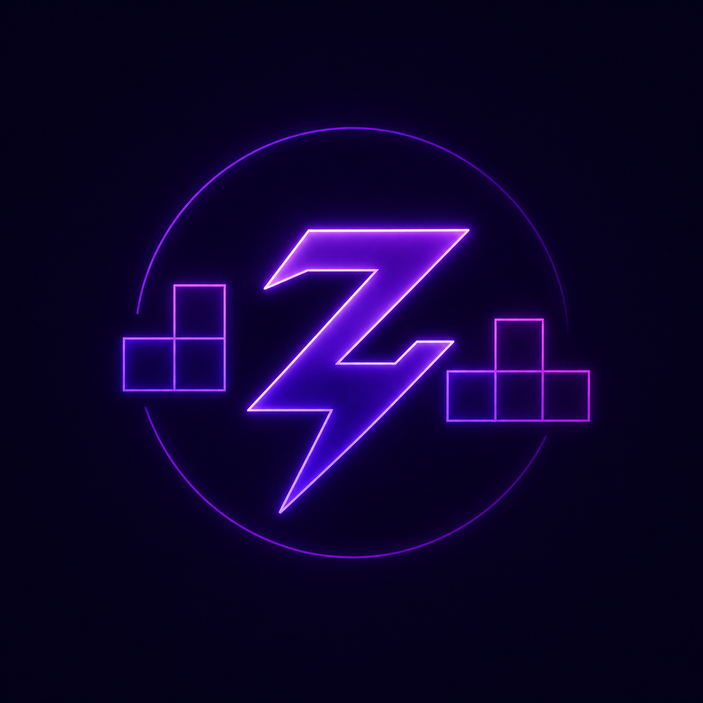
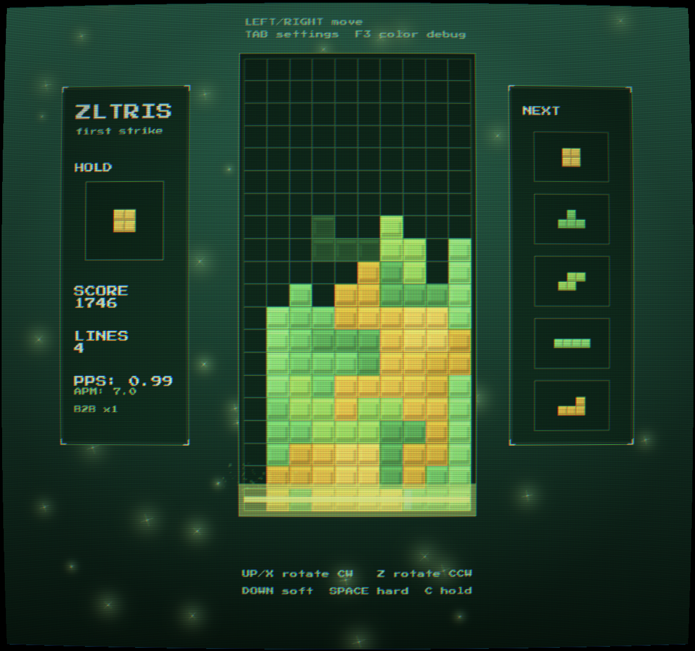
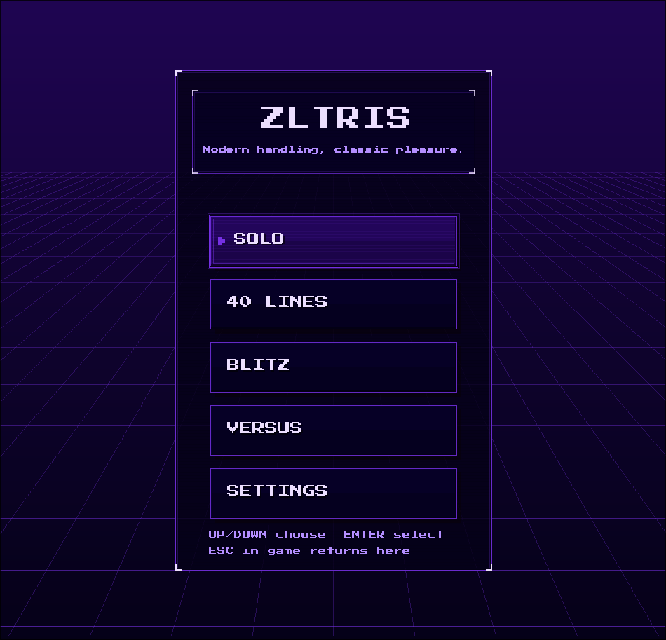
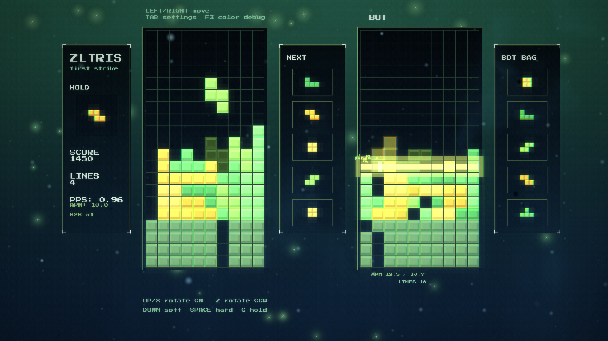
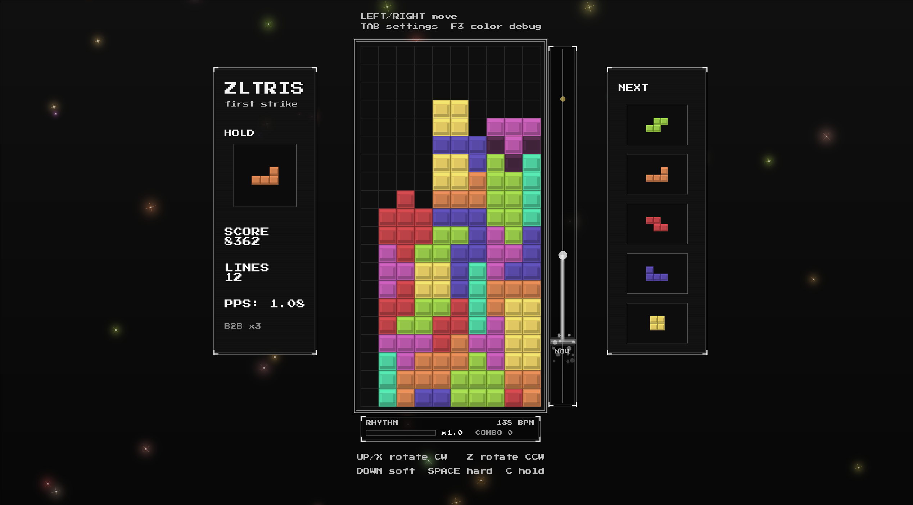
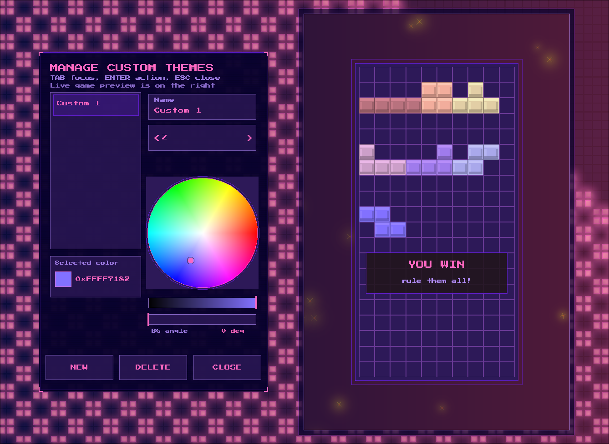
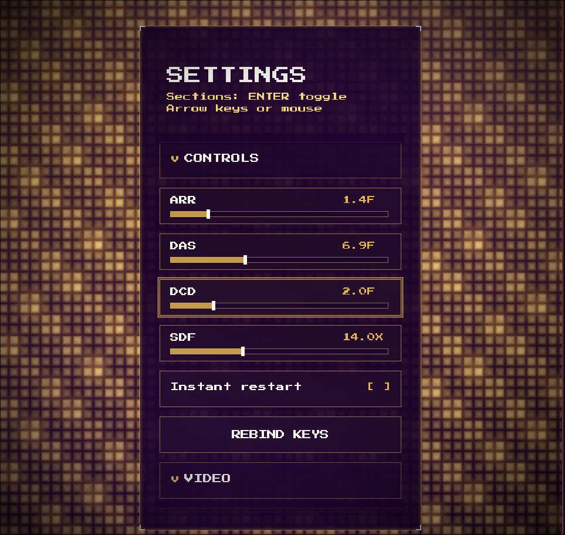

<p align="center">
  
</p>

<h1 align="center">zltris</h1>

<p align="center">
  A feature-rich, Tetrio-inspired Tetris game written entirely in <a href="https://github.com/zlangdevs/zlang">ZLang</a>.
</p>

<p align="center">
  Competitive guideline mechanics · heuristic AI opponent · procedural audio ·<br/>
  real-time post-processing shaders · custom online multiplayer protocol — all in a single codebase.
</p>

<p align="center">
  
  
  
  <a href="LICENSE"></a>
</p>

## Screenshots

<p align="center">
  
  
</p>
<p align="center">
  
</p>
<p align="center">
  
</p>
<p align="center">
  
  
</p>

## Features

### Game Modes
| Mode | Description |
|---|---|
| **Free Play** | Unlimited practice with optional garbage injection via keybind |
| **40 Lines** | Sprint — clear 40 lines as fast as possible |
| **Blitz** | Score as many points as possible in 120 seconds |
| **Vs Bot** | One-on-one match against a heuristic AI with configurable difficulty |
| **Challenge** | Custom rules: board size, gravity curve, kick tables, garbage modes, infinite hold |
| **Combo Trainer** | Preset column layouts to practice looping T-spin / ST stacking patterns |
| **Rhythm** | Sync piece drops to beat-detected music (built-in or custom tracks) |
| **Online Duel** | Multiplayer via the ZD1 text protocol over TCP (up to 8 peers) |

### Gameplay
- 7-bag randomizer, hold piece, 14-piece queue preview
- SRS / wall-kick rotation with configurable kick tables
- T-spin detection (3-corner rule), back-to-back bonus, combos, all-clear
- Delayed auto shift (DAS), auto-repeat rate (ARR), soft-drop factor (SDF), lock delay with DCD
- Garbage system with configurable delay and messiness
- Board shake on hard drops and line clears

### AI
- Heuristic evaluation function with **221 tunable weights**
- Three behavioral modes: **Clean** (flat stacking), **Dig** (garbage removal), **Survive** (panic avoidance)
- Beam-search pathfinder with greedy queue lookahead
- Threaded async worker — AI computes on a separate thread while the game keeps running
- Bot duel arena: evolutionary weight tuning via round-robin tournaments
- Configurable target APM, garbage messiness, high-stack tolerance, and panic burst behavior

### Graphics & UI
- 648×920 virtual canvas, auto-scaled to any window size (min 420×620, resizable)
- **6 built-in themes** (ZLang Neon, Synth Pulse, Night Circuit, Circuit Bloom, Golden Mayhem, Competitive)
- **12 custom theme slots** — full RGBA color picker for every UI element
- CRT curvature + VHS wave/damage post-processing shaders
- Custom GLSL shader support (3-layer compositing: background, blocks, UI)
- Animated starfield background with PPS-reactive particle bursting
- Bars visualization mode as alternative background
- Screen transition wipe effects
- Hold-to-restart / hold-to-menu gesture with visual charge bar

### Audio
- **Entirely procedural** — all sound effects are synthesized at load time via waveform generation (sine, triangle, pulse waves with saturation, layering, and ADSR envelopes)
- 14 distinct SFX: menu navigation, hard drop, lock, line clears (1–4), combos, back-to-back, all-clear, garbage warnings
- Beat-synced music player with aubio beat detection (supports WAV/MP3/OGG)
- Pitch/volume modulation based on gameplay intensity

### Networking
- **ZD1 protocol**: pipe-delimited text frames over TCP, no TLS (LAN / trusted-network focus)
- Host-client architecture with up to 8 peers per room
- Spectator support
- Configurable match rules (board size, gravity, kick table, garbage delay, etc.)
- State replication via 10 Hz snapshots, attacks as authoritative events
- Full protocol spec at `docs/online_duel_protocol.md`

### Customization
- Persistent settings in `zltris.cfg` (auto-generated at runtime)
- Full keybinding remapping (primary + secondary)
- DAS / ARR / SDF / lock delay tuning
- Post-FX shader selection and intensity sliders
- Background style (stars or bars), intensity, color
- Music mode: built-in playlist or custom directory

## Building

zltris is written in **ZLang** and requires the [ZLang compiler](https://github.com/zlangdevs/zlang).

### Prerequisites
- ZLang compiler v0.1.0+
- raylib 5.6+ (pre-built `libraylib.a` provided in `bin/`)
- aubio (beat detection, `libaubio.a` provided in `bin/`)
- OpenGL, X11, pthreads, ALSA / PulseAudio (typical Linux dev setup)

### Build
```bash
zlang -o zltris . -optimize 
```

The compiler picks up `#flag` directives in `src/wrappers/raylib.zl` for linker flags.

Output goes to `output/zltris` (directory is gitignored).

### Assets
- Font: place `PressStart2P.ttf` at `assets/fonts/PressStart2P.ttf` (falls back to raylib default)
- Shaders: GLSL files in `assets/shaders/`
- Music: audio files in `assets/songs/`

## Project Structure

```
zltris/
├── assets/          # fonts, shaders, songs, screenshots
│   ├── fonts/
│   ├── shaders/
│   ├── songs/
│   └── screenshots/
├── bin/             # pre-built static libraries (libraylib.a, libaubio.a)
├── docs/            # protocol specification
│   └── online_duel_protocol.md
├── src/
│   ├── core/        # entry point, global state, settings, post-FX
│   │   ├── main.zl
│   │   ├── state.zl
│   │   ├── context.zl
│   │   └── config_postfx.zl
│   ├── game/        # board logic, update loop, scoring, mode flow
│   │   ├── board.zl
│   │   ├── update.zl
│   │   ├── score_lock.zl
│   │   ├── mode_flow.zl
│   │   ├── layout.zl
│   │   ├── keybinds.zl
│   │   └── ... (bot duel setup, settings session)
│   ├── ai/          # heuristic evaluation, search, bot planning, tuning
│   │   ├── evaluation.zl
│   │   ├── search.zl
│   │   ├── state.zl
│   │   ├── pieces.zl
│   │   ├── rate.zl
│   │   ├── bot_planning.zl
│   │   ├── worker.zl
│   │   ├── tuning.zl
│   │   └── arena_tuning.zl
│   ├── ui/          # rendering, theming, menus, HUD, transitions
│   │   ├── ui.zl
│   │   ├── theme.zl
│   │   ├── scale.zl
│   │   ├── render_app.zl
│   │   ├── menu.zl
│   │   ├── board_views.zl
│   │   ├── sidear.zl
│   │   ├── overlays.zl
│   │   ├── settings_screen.zl
│   │   └── ... (animation, screen transitions, pickers)
│   ├── platform/    # audio, SFX, music, networking
│   │   ├── sfx.zl
│   │   ├── star_music.zl
│   │   └── online_duel_net.zl
│   └── wrappers/    # raylib, socket, aubio FFI bindings
│       ├── raylib.zl
│       ├── net_socket.zl
│       └── aubio.zl
└── .gitignore
```

## Controls

| Action | Default Key |
|---|---|
| Move left / right | Left / Right arrow |
| Soft drop | Down arrow |
| Hard drop | Space |
| Rotate clockwise | Up arrow / X |
| Rotate counter-clockwise | Z |
| Hold | C / Shift |
| Restart (hold) | R |
| Menu (hold) | Escape |

All keybinds are remappable in the settings screen (primary + secondary bindings per action).

## License

Licensed under the **GNU General Public License v3.0** — see [LICENSE](LICENSE).

## Credits

- Built with [ZLang](https://github.com/hedgegold/zlang/zlx)
- Graphics via [raylib](https://www.raylib.com/)
- Beat detection via [aubio](https://aubio.org/)
- Font: Press Start 2P by CodeMan38
- Music: [Karl Casey @ White Bat Audio](https://karlcasey.bandcamp.com/) (free for profit)
